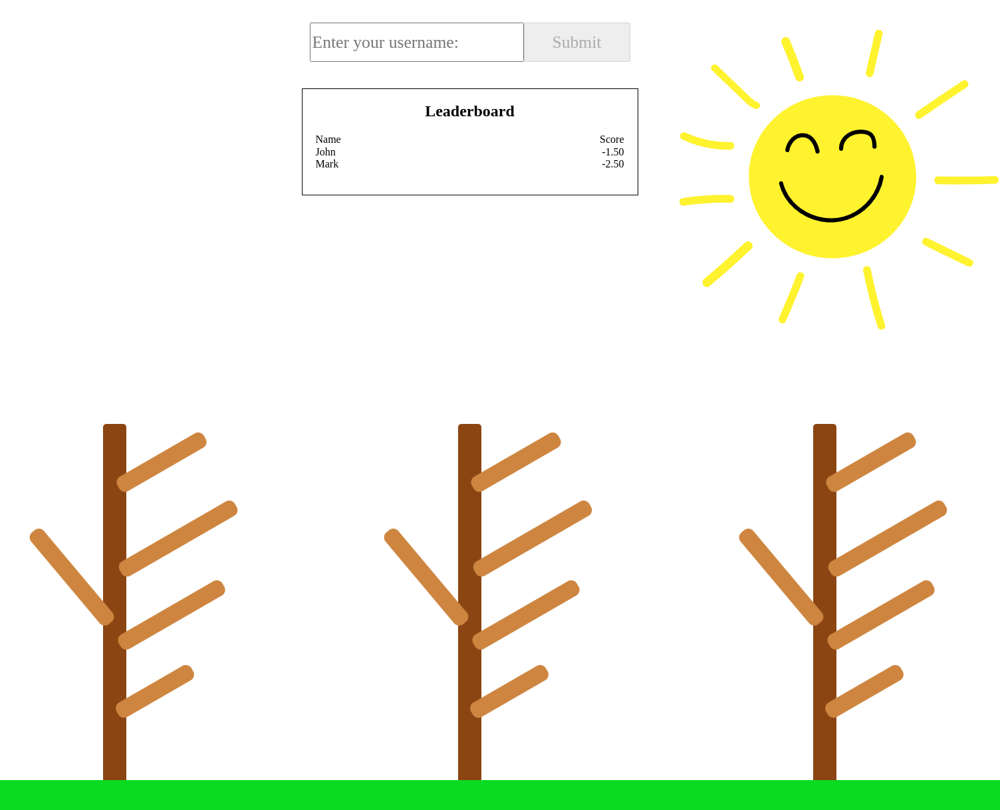
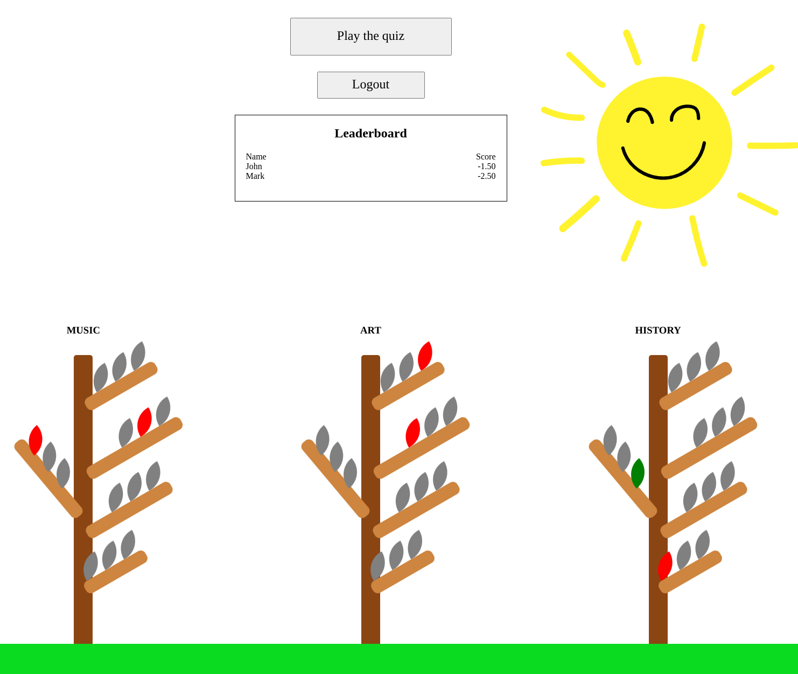

<h1 align="center">Welcome to hugs-for-bugs 👋</h1>

<p>
  
  
  
  <a href="https://github.com/Kspiropali/hugs-for-bugs" target="_blank">
    
  </a>
  <a href="https://github.com/kspiropali/hugs-for-bugs/graphs/commit-activity" target="_blank">
    
  </a>
  <a href="https://github.com/kefranabg/readme-md-generator/blob/master/LICENSE" target="_blank">
    
  </a>
  <a href="https://github.com/Kspiropali/hugs-for-bugs/actions/workflows/build.yml" target="_blank">
    
  </a>
</p>

> A cycle 1 of [La Fosse Academy's](https://www.lafosseacademy.com/) projects demonstrating the utilization of different
> framework technologies in order to create a basic but efficient quizzlet

## 🏠 [Homepage](https://github.com/Kspiropali/hugs-for-bugs)

## ✨ [Demo](https://hugs-for-bugs.onrender.com)

## 📷 [Screenshots]()





## Prerequisites

- npm >=9.5.0
- node >=18.16.0/lts-hydrogen
-
    - [express](https://expressjs.com/)
-
    - [cors](https://www.npmjs.com/package/cors)
-
    - [dotenv](https://www.dotenv.org/docs/)
-
    - [express-rate-limit](https://www.npmjs.com/package/express-rate-limit)

## Dev-Prerequisites

-
    - [jest](https://jestjs.io/)
-
    - [supertest](https://www.npmjs.com/package/supertest)

## Install

```bash
npm i
```

# Usage

```bash
npm run start
```

# Run tests

```bash
npm run test
```

# Docker Deployment

- ### You can very easily use the latest stable updated image on the docker hub to instantly run the app:
    ```Docker
    (*sudo) docker run -d -p 8080:8080 my-express-app
    ``` 
- ##### *sudo is for linux distributions users that are not in [the docker group](https://docs.docker.com/engine/install/linux-postinstall/).

# Future Updates

- ## Database
-
    - Plug in a real database such as [postgreSQL](https://www.postgresql.org/)
-
    - Plug in a caching/memory based database such as [redis](https://redis.io/)
-
    - Harden above databases with ip [filtering/selective management](https://www.pgadmin.org/)
- ## Security related features
-
    - Login with a username and additionally a password
-
    - Encrypt all incoming and outgoing connections with SSL/TLS(https)
-
    - Hashing passwords, server principal roles and etc.
-
    - Use csrf tokens to crombat Cross Origin Attacks([CORS](https://developer.mozilla.org/en-US/docs/Web/HTTP/CORS)).
-
    - Implement per user session, allow users only from a
      running [session at a time](https://developer.mozilla.org/en-US/docs/Web/HTTP/Session)
-
    - Create a [docker-compose](https://docs.docker.com/compose/) alternative which will enforce strict routing rules
      from/to the backend/databases/clients
-
    - Possibly use [nginx as proxy](https://nginx.org/en/#basic_http_features) to hide actual backend and/or rewrite
      header
-
    - Implement stricter github push/pull rules, add automated bots
- ## CI/CD
-
    - Possibly use kubernetes for mass deployment to multiple servers
-
    - Jenkins integration
-
    - Create a second deployment server for the dev environment
- ## Management
-
    - Create admin accounts, able to CRUD to the database
-
    - Allow management panel to view server logs
-
    - Ability to reboot/replace server
- ## Misc
-
    - Usage of websockets so users can communicate in realtime between them
-
    - Usage of SSE(server sent events) so that leaderboard updates are handled more efficiently
-
    - Usage of GRPCs for better blob data transfer
-
    - Usage of css technologies such as tailwindcss, bootstrap and etc to make UI more elegant
-
    - Usage of different effect js libraries such as particlesjs to make UI more elegant

# Bugs Encountered and solution

- In order to reuse a template variable multiple times for and endpoint,
  a [copy on clone method](https://developer.mozilla.org/en-US/docs/Web/API/structuredClone) is needed instead of the
  default pass by reference that is in place. So:

  ```javascript
  const studentsTemplate = { name: "test", data: ["data1", "data2", "data3"] };
  let studentsArr = [];

  for (let i = 0; i < 10; i++) {
    studentsTemplate.name = studentsTemplate.name + " " + i;
    studentsArr.push();
  }
  ```

  Would produce an array with 9 copies of the last element that was pushed.

- In order to serve html/css and generally any static files from express js(and other frameworks typically), we can't
  link them from the html pages directly by using relative pathing. Instead, we also need to serve all the static files
  that will be used by declaring a static path like so:

  ```javascript
  const path = require("path");
  // root path of project folder, going 1 directory back since
  // the index.js was in a server/ folder
  const project_dir = path.join(__dirname, "..");
  // or any other static folders from the perspective
  // of the root project location
  app.use(express.static(project_dir + "/client/res/"));

  // resources can the be accessed normally via the server's url
  // http://localhost:8080/image.png
  ```
  
- In cases where we have multiple checks for the json key-value pair, in order to properly test the backend api, we should progressively
  create alternative json files with valid most key-value pairs and the remaining invalid. For example:

  ```javascript
    // valid.json
    let partiallyValid = {
        question: "Which band released the album 'Dark Side of the Moon'?",
        answer: "Pink Floyd",
        name: 123
    }
  ```
- In this case, if we want to check if the name key-value was checked properly, we would need to provide valid question & answer
  key-value pairs, or otherwise the backend would reply with 400 Bad Request, but without checking the actual name key-value pair.
  

# Authors

**👤 Kristian Spiropali, 👤 Balram Singh, 👤 Valentin Abrutin**

- GitHub: [@kspiropali](https://github.com/kspiropali)
- GitHub: [@bobzila1202](https://github.com/bobzila1202)
- GitHub: [@valentin-ab](https://github.com/valentin-ab)

# 🤝 Contributing

Contributions, issues and feature requests are welcome!<br />Feel free to
check [issues page](https://github.com/Kspiropali/hugs-for-bugs/issues). You can also take a look at
the [contributing guide](CONTRIBUTING.md).

# 📝 License

Copyright ©
2023 [Kristian Spiropali(Kspiropali), Balram Singh(bobzila1202), Valentin Abrutin(valentin-ab)](https://github.com/kspiropali).<br />
This project
is [](https://opensource.org/licenses/MIT) licensed.
